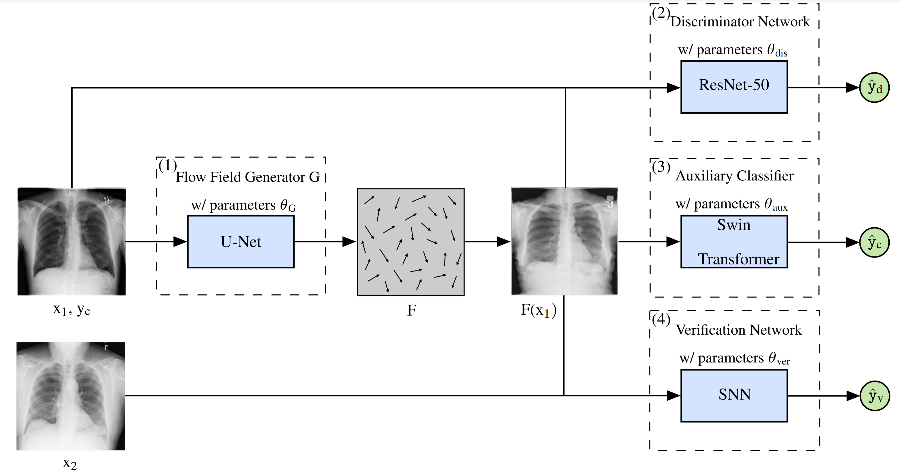

# PriSwin-Net

PriSwin-Net is a deep learning model for anonymizing and classifying chest radiographs, specifically designed to balance patient privacy with medical utility. This project adapts the [PriCheXy-Net](https://github.com/kaipackhaeuser/PriCheXy-Net) by incorporating a Swin Transformer architecture to enhance privacy preservation and classification accuracy.

<figure>
    
    <figcaption>Overview of PriSwin-Net Architecture</figcaption>
</figure>

## Key Features

- **Anonymization Focus**: Utilizes a sophisticated deformation field to protect patient identity in chest X-rays.
- **Swin Transformer Integration**: Employs Swin Transformer for robust feature extraction and classification.
- **Flexible Configuration**: Offers customizable parameters for different anonymization and classification needs.
- **Pre-trained Models**: Includes pre-trained weights for faster experimentation and deployment.

## Table of Contents

- [Requirements](#requirements)
- [Installation](#installation)
- [Usage](#usage)
  - [Pre-training](#pre-training-of-the-flow-field-generator)
  - [Training](#training-of-priswin-net)
  - [Evaluation](#evaluation)
- [Results](#results)
  - [Performance Comparison](#performance-comparison)
- [License](#license)
- [Acknowledgments](#acknowledgments)

## Requirements

- **Python**: Version 3.9.5 is recommended.
- **PyTorch**: Ensure PyTorch 1.10.2 or higher is installed.
- **Packages**: Install required packages listed in `requirements.txt`:

  ``` 
  pip install -r requirements.txt
  ```

## Installation

1. **Clone the repository**:

   ``` 
   git clone https://github.com/your-username/priswin-net.git
   cd priswin-net
   ```

2. **Install dependencies**:

   ``` 
   pip install -r requirements.txt
   ```

3. **Download Pre-trained Models** (optional):

   Download pre-trained weights from [here](https://github.com/rajaatreja/Pre-trained-Weights) and place them in the `./networks/` directory.

## Usage

### Pre-training of the Flow Field Generator

Set the experiment configuration in `./config_files/config_pretrain.json`. Key parameters include:

- **"generator_type"**: Either "flow_field" (for PriSwin-Net) or "privacy_net".
- **"mu"**: The deformation degree, e.g., 0.01.

Execute pre-training with:

``` 
python3 pretrain_generator.py --config_path ./config_files/ --config config_pretrain.json
```

### Training of PriSwin-Net

Configure the experiment in `./config_files/config_anonymization.json`. Important parameters include:

- **"ac_loss_weight"**: Set to 1 for experiments.
- **"ver_loss_weight"**: Set to 1 for experiments.
- **"generator_type"**: Either "flow_field" (for PriSwin-Net) or "privacy_net".
- **"mu"**: The deformation degree, e.g., 0.01.

Run training with:

``` 
python3 train_architecture.py --config_path ./config_files/ --config config_anonymization.json
```

### Evaluation

#### Verification Model

Set parameters in `./config_files/config_retrainSNN.json` and execute:

``` 
python3 retrain_SNN.py --config_path ./config_files/ --config config_retrainSNN.json
```

#### Classification Model

Configure `./config_files/config_eval_classifier.json` and run:

``` 
python3 eval_classifier.py --config_path ./config_files/ --config config_eval_classifier.json
```

Compute confidence intervals using:

```python
bootstrap_abnormalities()
```

in `./utils/utils.py`.

## Results

### Performance Comparison

The table below highlights PriSwin-Net's performance across different configurations:

| Model        | Aux. Class. Weight | Aux. Ver. Weight | Learning Rate | Aux. Class. Optimized | DenseNet | Swin Transformer | Verification Score |
|--------------|--------------------|------------------|---------------|-----------------------|----------|------------------|--------------------|
| Real Data    | -                  | -                | -             | -                     | 80.5     | 84.3             | 81.8 ± 0.6         |
| PriCheXy-Net | 1                  | 1                | 10⁻⁴          | ✔                     | 76.2     | -                | 57.7 ± 4.0         |
| PriSwin-Net  | 1                  | 1                | 10⁻⁴          | ✔                     | 75.4     | 83.2             | 62.9 ± 4.9         |
| PriSwin-Net  | 1                  | 1                | 10⁻⁴          | ✖                     | 77.0     | -                | 66.6 ± 4.0         |

### PriSwin-Dis

Below are the results of PriSwin-Dis across various configurations:

| Exp. No. | Experiment Name             | GPU  | Batch Size | μ    | Aux. Weights (ac, vr, dc) | Learning Rate (Global, Local) | Dis. Loss avg. | Gradient Clipping | Aux. Class. optimized | VR Log Likel. | Class. Score (DenseNet)($\\uparrow$) | Ver. Score ($\\downarrow$) |
|----------|-----------------------------|------|------------|------|---------------------------|------------------------------|----------------|------------------|------------------------|---------------|--------------------------------------|--------------------------|
| exp3     | PriSwin-Dis (ResNet-50)     | 2080 | 8          | 0.01 | (1, 1, 1)                 | (10⁻⁴, -)                   | -              | ✖                | ✔                      | ✔             | 74.5 (DenseNet), 82.9 (SwinT)        | 51.6 ± 1.8               |
| exp15    | PriSwin-Dis                 | A100 | 32         | 0.01 | (1, 1, 1)                 | (10⁻⁵, -)                   | C₁ & C₂        | ✖                | ✔                      | ✖             | 77.0                                | 62.2 ± 3.6               |

## License

This project is licensed under the GNU General Public License (GPL). For more details, refer to the [LICENSE](LICENSE) file.

## Acknowledgments

- The [Swin Transformer](https://github.com/microsoft/Swin-Transformer) team for their innovative architecture.
- The creators of [PriCheXy-Net](https://github.com/kaipackhaeuser/PriCheXy-Net) for foundational insights and techniques.
